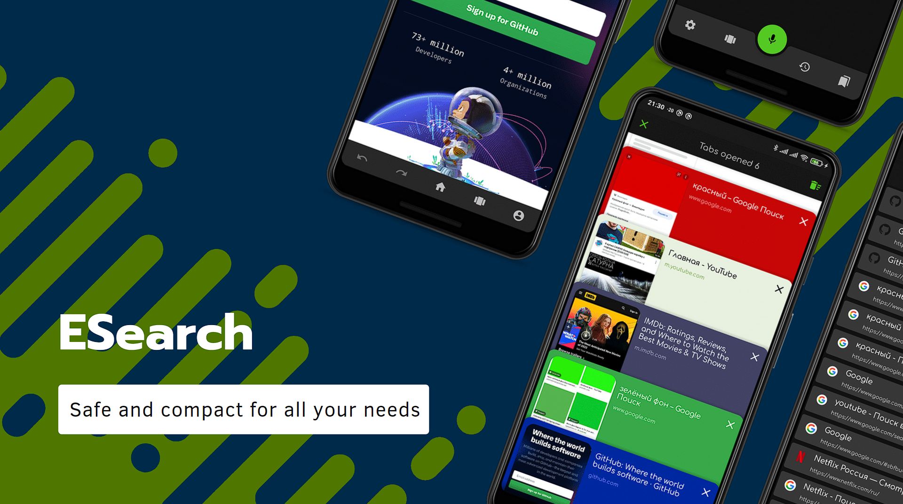

<h1 align="center">LiteBrowser</h1>

  
  

A fast, lightweight Android browser built for privacy and speed. 
Built-in ad blocker, dark mode, multi-tab browsing, and custom themes. 
Only ~2MB — lighter than most browsers.

---

## Features

- 🛡️ **Ad Blocker** — Built-in ad blocking removes ads, popups, and trackers
- 🌙 **Dark Mode** — Instant dark mode with CSS injection
- 📑 **Multi-Tab** — Smooth tab management with bottom navigation
- 🔖 **Bookmarks** — Save and organize your favorite sites
- 🎨 **Themes** — 8 custom themes to personalize your experience
- 🖥️ **Desktop Mode** — View desktop versions of websites
- 🏠 **Home Button** — Quick access to your homepage
- 🔄 **Pull to Refresh** — Refresh pages with a simple gesture
- 📡 **Offline Detection** — Smart offline status indicator

## Download

Download the latest APK from [Releases](https://github.com/yossweh/lite-browser/releases/tag/v57).

Also available on:
- [APKPure](https://apkpure.com/p/com.litebrowser)
- [itch.io](https://0xchapo.itch.io/litebrowser)

## Tech Stack

- **Language:** Kotlin
- **Min SDK:** 21 (Android 5.0)
- **Architecture:** MVVM with Room database
- **UI:** Material Design Components
- **Browser:** Android WebView with WebKit

### Libraries
- Room Persistence — local database for bookmarks
- RecyclerView — efficient list display
- ViewBinding — type-safe view references
- Glide — image loading
- Material Components — Material Design UI
- Looping Layout — infinite scroll
- WebKit — modern WebView API

## Permissions

- `INTERNET` — Required for browsing
- `WRITE_EXTERNAL_STORAGE` — For downloading files

No unnecessary permissions. No tracking. No data collection.

## Privacy

LiteBrowser respects your privacy:
- No user accounts required
- No analytics or tracking
- No data sent to external servers
- Browsing data stays on your device

See [PRIVACY.md](PRIVACY.md) for full details.

## Open Source

LiteBrowser is open source under the [Apache 2.0 License](LICENSE).

Originally based on [ESearch](https://github.com/T8RIN/ESearch) by T8RIN.

## Contributing

Contributions are welcome! Please feel free to submit a Pull Request.

## Contact

- GitHub: [@yossweh](https://github.com/yossweh)
- Issues: [GitHub Issues](https://github.com/yossweh/lite-browser/issues)
